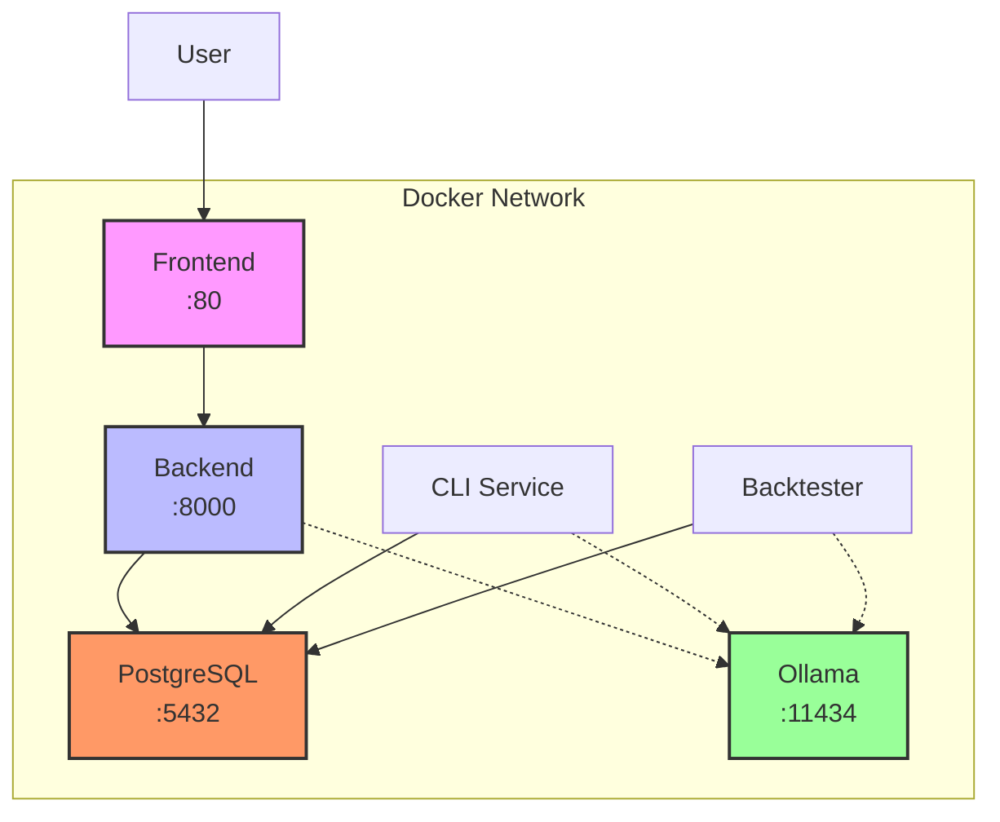

# AI Hedge Fund - 部署指南

## Docker Compose 部署

### 前置要求

1. **Docker**: 版本 20.10+
2. **Docker Compose**: 版本 2.0+
3. **Git**: 用于克隆代码
4. **API Keys**: 至少需要一个LLM API密钥

### 快速部署

#### 1. 准备环境

```bash
# 克隆仓库
git clone https://github.com/your-username/ai-hedge-fund.git
cd ai-hedge-fund

# 复制环境变量文件
cp .env.example .env

# 编辑.env文件，添加你的API密钥
nano .env
```

必须配置的环境变量：
```env
# LLM API密钥 (至少配置一个)
OPENAI_API_KEY=your-openai-api-key
# 或者
ANTHROPIC_API_KEY=your-anthropic-api-key
# 或者
GROQ_API_KEY=your-groq-api-key

# 金融数据API (可选，免费股票不需要)
FINANCIAL_DATASETS_API_KEY=your-financial-datasets-api-key
```

#### 2. 启动服务

**基础部署（Web应用）**：
```bash
docker-compose up -d
```

访问：
- 前端: http://localhost
- 后端API: http://localhost:8000/docs

**带Ollama本地模型**：
```bash
docker-compose --profile with-ollama up -d
```

**运行CLI模式**：
```bash
docker-compose --profile cli run hedge-fund-cli
```

**运行回测**：
```bash
docker-compose --profile backtester run backtester
```

#### 3. 验证部署

```bash
# 检查服务状态
docker-compose ps

# 查看日志
docker-compose logs -f backend
docker-compose logs -f frontend

# 健康检查
curl http://localhost:8000/api/health
```

### Docker镜像构建详情

#### 后端镜像 (Dockerfile.backend)

基于Python 3.11，包含：
- FastAPI应用服务器
- 所有Python依赖
- AI代理逻辑
- 数据库迁移工具

特性：
- 多阶段构建优化镜像大小
- Poetry依赖管理
- 热重载开发模式

#### 前端镜像 (Dockerfile.frontend)

基于Node 18和Nginx，包含：
- React构建产物
- Nginx反向代理
- 静态资源优化

特性：
- 生产级Nginx配置
- Gzip压缩
- API代理配置

### 服务架构



### 数据持久化

Docker volumes用于持久化数据：
- `postgres_data`: 数据库数据
- `ollama_data`: Ollama模型缓存

备份数据：
```bash
# 备份数据库
docker-compose exec postgres pg_dump -U hedge_fund hedge_fund_db > backup.sql

# 恢复数据库
docker-compose exec -T postgres psql -U hedge_fund hedge_fund_db < backup.sql
```

### 配置说明

#### docker-compose.yml配置项

1. **postgres服务**
   - 数据库服务
   - 健康检查确保启动顺序
   - 端口5432暴露（可选）

2. **backend服务**
   - FastAPI应用
   - 自动数据库迁移
   - 热重载开发模式
   - 环境变量注入

3. **frontend服务**
   - Nginx静态服务
   - 反向代理到backend
   - 生产优化配置

4. **ollama服务**
   - 可选profile
   - GPU支持配置
   - 本地LLM运行

### 常见问题

#### 1. 端口冲突
如果端口已被占用，修改docker-compose.yml：
```yaml
ports:
  - "8080:80"      # 前端改为8080
  - "8001:8000"    # 后端改为8001
```

#### 2. 内存不足
增加Docker内存限制：
```yaml
deploy:
  resources:
    limits:
      memory: 4G
```

#### 3. Ollama GPU支持
确保安装NVIDIA Docker支持：
```bash
# 安装nvidia-docker2
sudo apt-get install nvidia-docker2
sudo systemctl restart docker
```

### 生产环境建议

1. **使用环境特定配置**
   ```bash
   docker-compose -f docker-compose.yml -f docker-compose.prod.yml up
   ```

2. **启用HTTPS**
   - 使用Traefik或Nginx反向代理
   - 配置SSL证书

3. **监控和日志**
   - 集成Prometheus/Grafana
   - 使用ELK Stack收集日志

4. **备份策略**
   - 定期数据库备份
   - 使用外部存储服务

5. **安全加固**
   - 不暴露数据库端口
   - 使用强密码
   - 限制网络访问

### 更新部署

```bash
# 拉取最新代码
git pull

# 重建镜像
docker-compose build

# 重启服务
docker-compose down
docker-compose up -d

# 运行数据库迁移
docker-compose exec backend alembic upgrade head
```

### 故障排查

```bash
# 查看所有日志
docker-compose logs

# 进入容器调试
docker-compose exec backend bash
docker-compose exec frontend sh

# 检查网络
docker network inspect ai-hedge-fund-network

# 资源使用情况
docker stats
```