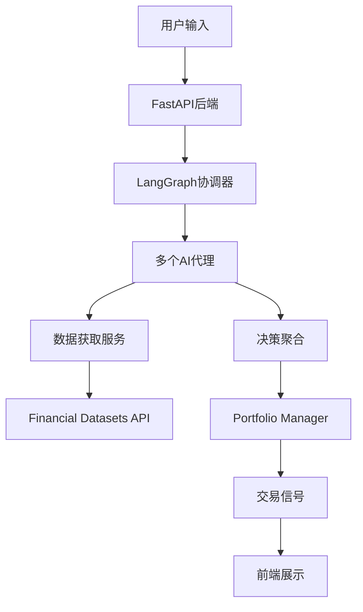

# AI Hedge Fund - 项目架构分析

## 项目概述

AI Hedge Fund 是一个教育目的的概念验证项目，展示了如何使用AI进行交易决策。该系统通过多个智能代理协同工作，模拟各种著名投资者的策略。

## 技术栈

### 后端技术
- **Python 3.11**: 主要编程语言
- **FastAPI**: Web框架，提供REST API
- **Poetry**: 依赖管理
- **SQLAlchemy**: ORM框架
- **Alembic**: 数据库迁移工具
- **LangChain/LangGraph**: AI框架，构建智能代理
- **Pandas/NumPy**: 数据分析
- **支持的LLM提供商**:
  - OpenAI (GPT-4)
  - Anthropic (Claude)
  - Groq
  - DeepSeek
  - Google Gemini
  - Ollama (本地模型)
  - GigaChat
  - xAI

### 前端技术
- **React 18**: UI框架
- **TypeScript**: 类型安全
- **Vite**: 构建工具
- **Tailwind CSS**: 样式框架
- **Shadcn UI**: 组件库
- **React Flow**: 流程可视化

## 项目结构

```
ai-hedge-fund/
├── app/                    # 应用程序代码
│   ├── backend/           # FastAPI后端
│   │   ├── alembic/       # 数据库迁移
│   │   ├── database/      # 数据库模型和连接
│   │   ├── models/        # Pydantic模式
│   │   ├── repositories/  # 数据访问层
│   │   ├── routes/        # API路由
│   │   ├── services/      # 业务逻辑
│   │   └── main.py        # FastAPI应用入口
│   └── frontend/          # React前端
│       ├── src/
│       │   ├── components/  # React组件
│       │   ├── pages/       # 页面组件
│       │   ├── services/    # API客户端
│       │   └── App.tsx      # 主应用组件
│       └── package.json
├── src/                   # 核心AI逻辑
│   ├── agents/           # 智能代理实现
│   │   ├── warren_buffett.py
│   │   ├── cathie_wood.py
│   │   ├── peter_lynch.py
│   │   └── ... (其他18个代理)
│   ├── backtesting/      # 回测引擎
│   ├── data/            # 数据模型和缓存
│   ├── graph/           # LangGraph状态管理
│   ├── llm/             # LLM配置
│   ├── tools/           # 工具函数
│   └── main.py          # CLI入口
├── docker/              # Docker配置
│   ├── Dockerfile
│   └── docker-compose.yml
└── tests/               # 测试代码
```

## 核心架构设计

### 1. 多代理系统

系统包含18个专门的AI代理，每个代理模拟不同的投资策略：

#### 价值投资代理
- **Warren Buffett**: 寻找优质公司的合理价格
- **Charlie Munger**: Buffett的合作伙伴，关注商业模式
- **Ben Graham**: 价值投资之父，寻找安全边际
- **Michael Burry**: 深度价值投资，逆向思维

#### 成长投资代理
- **Cathie Wood**: 创新和颠覆性技术
- **Phil Fisher**: 通过深度研究寻找成长股
- **Peter Lynch**: 寻找"十倍股"

#### 技术分析代理
- **Technicals Agent**: 分析技术指标
- **Sentiment Agent**: 市场情绪分析
- **Fundamentals Agent**: 基本面分析
- **Valuation Agent**: 估值计算

#### 风险管理
- **Risk Manager**: 风险度量和仓位限制
- **Portfolio Manager**: 最终交易决策

### 2. 数据流架构



### 3. 数据库设计

使用SQLAlchemy ORM管理以下核心表：
- `hedge_fund_flows`: 交易流程记录
- `hedge_fund_flow_runs`: 运行实例
- `hedge_fund_flow_run_cycles`: 运行周期
- `api_keys`: API密钥管理

### 4. 回测引擎

支持多种策略回测：
- 仅做多策略
- 仅做空策略
- 多空策略
- 性能指标计算（夏普比率、最大回撤等）

## API架构

### 主要端点

- `/api/health` - 健康检查
- `/api/hedge-fund/run` - 执行交易决策
- `/api/flows` - 管理交易流程
- `/api/flow-runs` - 查看运行历史
- `/api/api-keys` - API密钥管理
- `/api/ollama` - Ollama服务管理
- `/api/language-models` - LLM配置

## 安全考虑

1. **API密钥管理**: 通过环境变量和数据库安全存储
2. **CORS配置**: 限制前端访问
3. **数据隔离**: 每个用户的数据独立存储
4. **无实际交易**: 仅供教育目的，不执行真实交易

## 部署架构

### Docker Compose部署
- 支持多个服务配置
- Ollama本地模型集成
- 容器化环境隔离

### 扩展性设计
- 微服务架构
- 异步处理
- 可水平扩展

## 性能优化

1. **缓存机制**: 金融数据缓存减少API调用
2. **异步处理**: FastAPI异步端点
3. **批量处理**: 支持多股票同时分析
4. **懒加载**: 前端组件按需加载